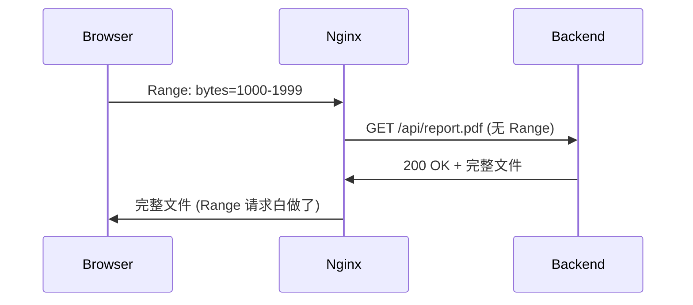

# learn-by-doing：项目驱动学习

## 共享原则

> 做中学哲学、四步法回答框架、费曼检验协议、自检4问、卡住5分钟规则、先跑通再理解、间隔复习队列 — 以上概念的**唯一权威定义**见 `_shared/core-principles.md`。
>
> **执行本技能前，先 Read `_shared/core-principles.md`。** 本文件仅记录 learn-by-doing 的特化规则。

---

## 技能边界：何时用本技能 vs 其他技能

| 场景 | 用谁 | 交接条件 |
|------|------|----------|
| **自学全新技术领域**（需要项目管理） | **learn-by-doing（本技能）** | 用户说"我想学 X" + 需要长期跨会话 |
| 引导式学习（含为什么/架构问题） | ai-era-learning | 用户问"为什么用X"/"这段代码什么意思" |
| 公司实训快速过关 | ops-training | 用户发"实训一 nginx"等大纲任务 |
| 复习已学内容 | deep-review | 用户说"复习"/"吃透"/"深挖" |
| 学完想巩固复习 | learn-by-doing Phase 6 → deep-review | 归档阶段自动建议 |

**核心区分**：learn-by-doing = 自驱项目 + 需要进度管理。如果只是问理解/判断层面的问题，用 ai-era-learning。

---

## Trigger 边界

**触发时：**
- 用户明确说"学习 X"、"继续学习"、"做个项目学 X"
- 用户在已有学习工作区中推进 todo、写 learning record、更新 wiki
- 用户说"考考我"、"出个排障题"、"复习一下"

**不触发：**
- 一次性概念解释 → ai-era-learning
- 普通 debug 或文档查询

---

## 工作区文件

| 文件 | 用途 | 必需 |
|------|------|------|
| `LEARNING_STATE.md` | 单一状态源：当前阶段、进度、薄弱点 | 运行时自动维护 |
| `MISSION.md` | 项目目标、验收标准、范围 | 是 |
| `LEARNING_MAP.md` | 模块化知识骨架，机器可读的主地图 | 是 |
| `TO_DO.md` | 任务列表，每条带验收命令 | 是 |
| `RESOURCES.md` | 可信资源索引，含版本和质量字段 | 是 |
| `GLOSSARY.md` | 术语表 | 推荐 |
| `NOTES.md` | 学习偏好 / 随手记 | 可选 |
| `REVIEW_QUEUE.md` | 间隔复习队列 | 推荐 |
| `learning-records/` | 学习记录（不是活动日志） | 是 |
| `ai/wiki/{topic}/` | 可喂 AI 的 Markdown 知识条目 | 是 |

### 文件格式模板

所有模板集中在 `formats/templates.md`。各文件模板：

**LEARNING_STATE.md**（AI 自动维护）：
```markdown
# Learning State
Topic: {技术/工具/框架名称}
Current phase: 0-7
Current project: {一句话}
Current todo: {T001 - 任务名 / none}
Last completed todo: {Txxx - 任务名}
Known weak spots: {逗号分隔}
Next review due: {YYYY-MM-DD}
Last session summary: {1-3句}
Blocked by: {阻塞原因 / none}
```

**MISSION.md**：
```markdown
# Mission
## 目标
{一句话说清要做什么}
## 验收标准
- [ ] {可验证的标准}
## 范围
- 包含: {范围}
- 不包含: {边界}
```

**LEARNING_MAP.md**：
```markdown
# Learning Map: {主题}
## 核心模块
- {模块名}: {一句话} → 前置依赖: {无 / 其他模块}
## 模块关系
{依赖图或文字描述}
```

**TO_DO.md**：
```markdown
# To Do
## {阶段/模块}
- [ ] T001 {任务名} — 验收: {命令或检查方法} (预估: {分钟}min)
```

**RESOURCES.md**：
```markdown
# Resources
| 资源 | 类型 | 版本 | 质量 | 备注 |
|------|------|------|------|------|
| {URL/书名} | {官方文档/教程/书} | {版本} | {可信/有坑/过时} | {说明} |
```

**GLOSSARY.md**：
```markdown
# Glossary
| 术语 | 一句话定义 | 相关概念 |
|------|-----------|----------|
| {术语} | {定义} | [[相关wiki]] |
```

**NOTES.md**：
```markdown
# Notes
## 学习偏好
- {偏好}

## 随手记
- {笔记} (YYYY-MM-DD)
```

**REVIEW_QUEUE.md**：见 `_shared/core-principles.md` §7。

**learning-records/** 格式：
```markdown
# {标题}
Date: YYYY-MM-DD
Evidence type: feynman | drill | review | debug
Status: active | weak-spot | resolved
Evidence: {具体证据}
Weak spots: {模糊点 / 无}
```

---

## Operating Rules

1. **每条 todo ≤ 30 分钟** — 超时自动切分
2. **每条 todo 必须有验收方法** — 可验证才算完成
3. **learning record 不是活动日志** — 只在有证据时写
4. **资源优先用官方/最新版** — 标记不确定或过时的来源
5. **不直接给故障根因** — 引导排查，先让用户尝试
6. **不覆盖用户文件** — 修改前确认
7. **启动时做 retrieval warm-up** — 先回顾再教新内容
8. **每次修改文件后通读全文** — 检查矛盾/过时内容

---

## 教学原则

> AI 时代的能力模型 + 三层次教学法 + 场景题设计 + 输出格式约定。
> 这些原则适用于 **Phase 0-7 全部阶段**，是 AI 教学行为的基础规范。

### 1. AI 时代的能力模型

AI 能生成代码和配置。学习者应培养 AI **做不到**的能力：

- **判断力**：评估 AI 输出的正确性、适用性、安全性
- **概念理解**：知道 X 解决什么问题、核心机制是什么
- **边界感知**：什么场景会出问题、常见坑是什么
- **排查能力**：出问题时能独立定位根因

以下能力**不应**作为教学重点（AI 做得更好）：

- 记忆具体参数值 / 配置语法 / 命令的完整选项列表
- 背诵 API 签名 / 端口号 / 默认值

教学时遵循：**不教参数表，教判断力；不给配置模板，给设计理由。**

### 2. 三层次教学法

每讲一个概念／配置／命令，必须按顺序覆盖三层：

```
1. 背景概念：为什么需要它？不用它会怎样？它解决什么场景？
2. 参数/配置含义：核心参数的作用，不要求记全部
3. 边界与坑：什么场景失效？常见误用？和谁容易搞混？
```

| 做法 | 判断 |
|------|------|
| 直接给 nginx 配置让用户复制 | 反例 — 没讲为什么这样写，用户不会判断 |
| 先讲需求场景 → 再讲配置为什么这样写 → 最后问"条件变了改哪里？" | 正例 |
| 给一整页参数表让用户背 | 反例 — AI 时代参数可查 |
| 讲核心参数的设计意图和取舍逻辑 | 正例 |

### 3. 场景题穿插

教学过程中定期穿插场景题（不同于 Phase 5 排障题）：

| 类型 | 考察 | 示例 |
|------|------|------|
| 容量场景 | 边界感知 | "并发从 100 涨到 10000，哪个配置会出问题？" |
| 故障场景 | 排查逻辑 | "用户反馈偶尔超时，你的排查路径是什么？" |
| 对比场景 | 概念理解 | "X 和 Y 都能做负载均衡，分别适合什么场景？" |
| 设计场景 | 判断力 | "这个需求，你选 X 还是 Y？为什么？" |

场景题在 Phase 3-5 中**定期穿插**，不等到 Phase 5 才集中做。

### 4. 可视化优先

讲解流程/时序/架构时，**优先用 Mermaid 图**。文字流程 → 时序图，架构关系 → 流程图。

**反例**（纯文字描述流程）：
```
浏览器发 Range → Nginx 没转发 → 后端返回完整文件 → 白做了
```

**正例**（Mermaid 时序图）：


更多转换示例见 `formats/diagram-examples.md`。

### 5. 输出格式约定

- **对比表**：用 XMind 兼容的 tab 缩进层级，不用 markdown 表格
- **流程/时序**：用 ```mermaid 代码块
- **命令**：带行内注释说明每部分作用，不只给裸命令
- **配置**：关键行加注释解释为什么这样写

**Markdown 表格 → XMind 格式示例**：

Markdown 表格（反例）：
```
| 类型 | 验证什么 | 速度 | 价格 |
| DV | 域名归属 | 实时 | 免费 |
| OV | 企业信息 | 几天 | 贵 |
```

XMind 格式（正例，tab 缩进表示层级）：
```
SSL 证书类型对比
	DV（域名验证）
		验证：域名归属
		速度：实时
		价格：免费（Let's Encrypt）
	OV（组织验证）
		验证：企业信息
		速度：几天
		价格：贵
	EV（扩展验证）
		验证：严格审核
		速度：更久
		价格：最贵，浏览器显示公司名
```

XMind 格式模板见 `formats/templates.md` §XMind 对比表。

---

## 流程参考

```
Phase 0: 初始化 → 问三个问题
Phase 1: 知识地图 → LEARNING_MAP.md
Phase 2: 定项目 → MISSION.md
Phase 3: 拆任务动手 → TO_DO.md → 逐条执行 → 更新 ai/wiki/
Phase 4: 费曼检验 → learning-records（有证据才写）
Phase 5: 排障练习 + 场景题 → 分层 drill（L1/L2/L3）+ 场景题交叉
Phase 6: 间隔复习 → REVIEW_QUEUE.md → 每次启动检索
Phase 7: 复盘归档 → cheatsheet + 下个项目规划
```

每个阶段的详细协议见 `workflows/` 目录。

---

## 跨会话恢复

见 `workflows/startup.md`。

---

## 安全约束

排障练习中的命令安全规则见 `safety/real-environment-commands.md`。
