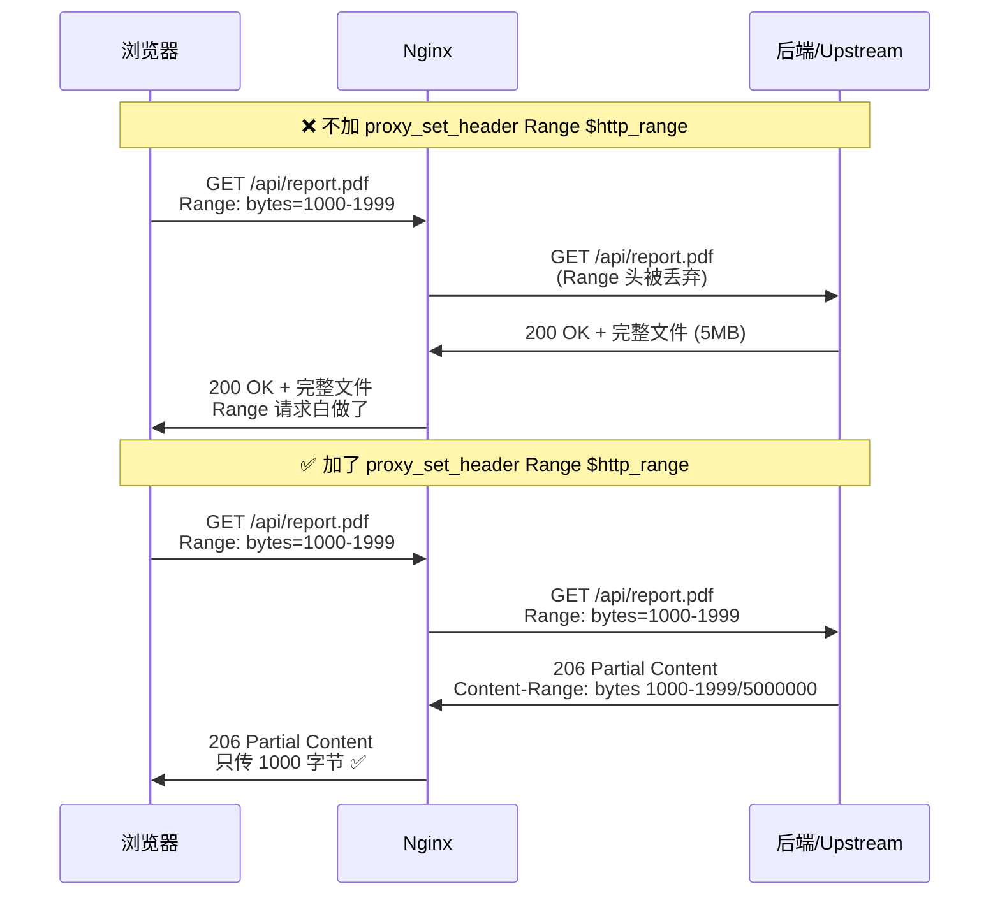
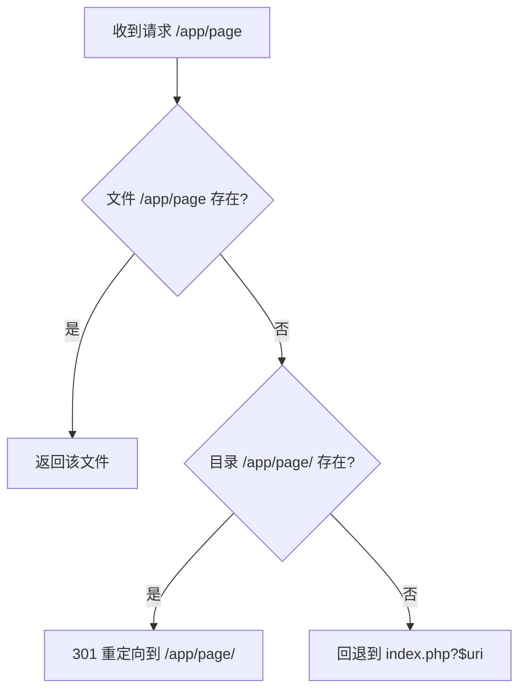
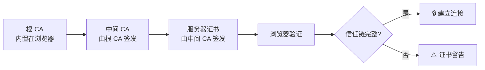

# Diagram Examples

> 如何把文字流程/架构说明转换为 Mermaid 图。
> AI 讲解时应优先使用 Mermaid，仅在 Mermaid 无法表达时用文字。
>
> 本文件引用见 `SKILL.md` §教学原则 > 可视化优先。

---

## 何时用哪种图

- **时序图（sequenceDiagram）**：请求/响应链路、消息传递、协议交互
- **流程图（flowchart）**：决策分支、状态转换、处理流程
- **甘特图（gantt）**：部署步骤、时间线计划（较少使用）

---

## 示例 1：文字流程 → 时序图

### 场景：Nginx 反向代理时 `proxy_set_header Range` 的作用

**文字版（反例，不要这样讲）：**
> $http_range 是 Nginx 内置变量。不加 proxy_set_header Range $http_range 的话，Nginx 默认不转发 Range 头给后端，后端返回完整文件。加了之后后端收到 Range，返回 206 + Content-Range，配合 proxy_buffering off 直接透传给浏览器。

**时序图版（正例，应该这样讲）：**

### 教学收益

- 用户能看到"加了 vs 没加"两条链路并行对比
- 消息携带的内容一目了然，不需要在脑中模拟
- 更容易理解为什么还需要 `proxy_buffering off`

---

## 示例 2：配置执行流程 → 流程图

### 场景：Nginx `try_files` 的执行逻辑

### 教学收益

- 分支逻辑可视化，用户不需要在脑中构建决策树
- 配合"这个请求走到哪个分支？"的场景题，直接指向图中节点

---

## 示例 3：架构关系 → 流程图

### 场景：HTTPS 证书验证链

---

## 规则

1. **Mermaid 优于文字**：任何涉及多步骤/多参与者/多分支的流程，首选 Mermaid
2. **图后必跟场景题**：画完图后至少问一个"哪一步会出问题？"类问题
3. **不要过度复杂**：单张图 ≤ 10 个节点/步骤，超过则拆分
4. **Note 框标注关键信息**：用 `Note` 在图中标记容易踩坑的位置
5. **对比场景用并行泳道**：正反例在同一张时序图中用 `Note over` 分隔
